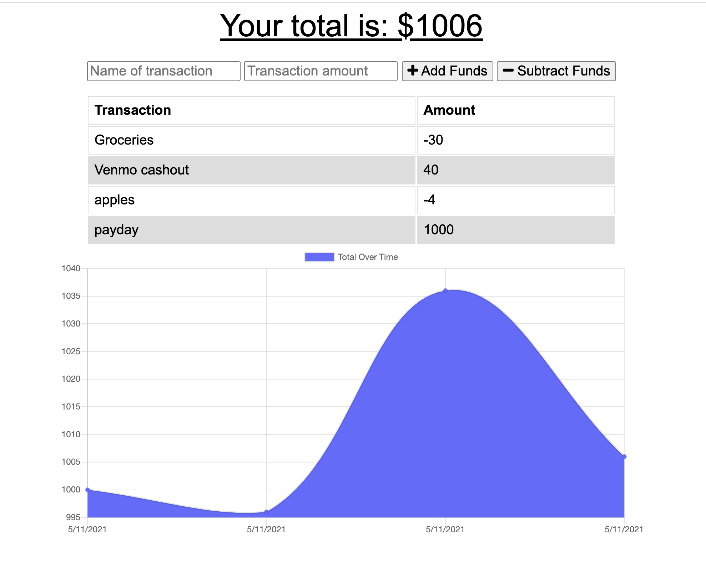

# Budget Tracker

## Description
This full-stack application allows users to track their finances by allowing them to input deposits and withdrawals both offline and online, using IndexedDB and the cache.

## Table of Contents
1. [Installation](#installation)
2. [Usage](#usage)
3. [License](#license)
4. [Contributing](#contributing)
4. [Tests](#tests)
5. [Questions](#questions)

## Installation
Visit our site at the deployed link: https://frozen-atoll-39935.herokuapp.com/ or download this code to run the application on a local server.

## Usage
Use the easy user interface to add and subract amounts of money, and watch the chart of your budget adjust accordingly.

## License
License type: BSD 3

## Contributing
None

## Tests

## Questions
For more information contact me:
- [GitHub](https://github.com/henderson2350)  
- My email: henderson2350@gmail.com